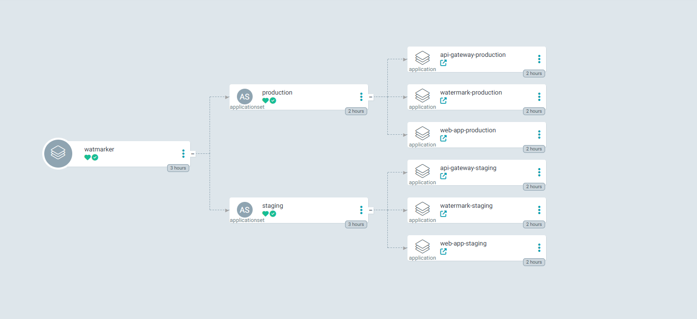
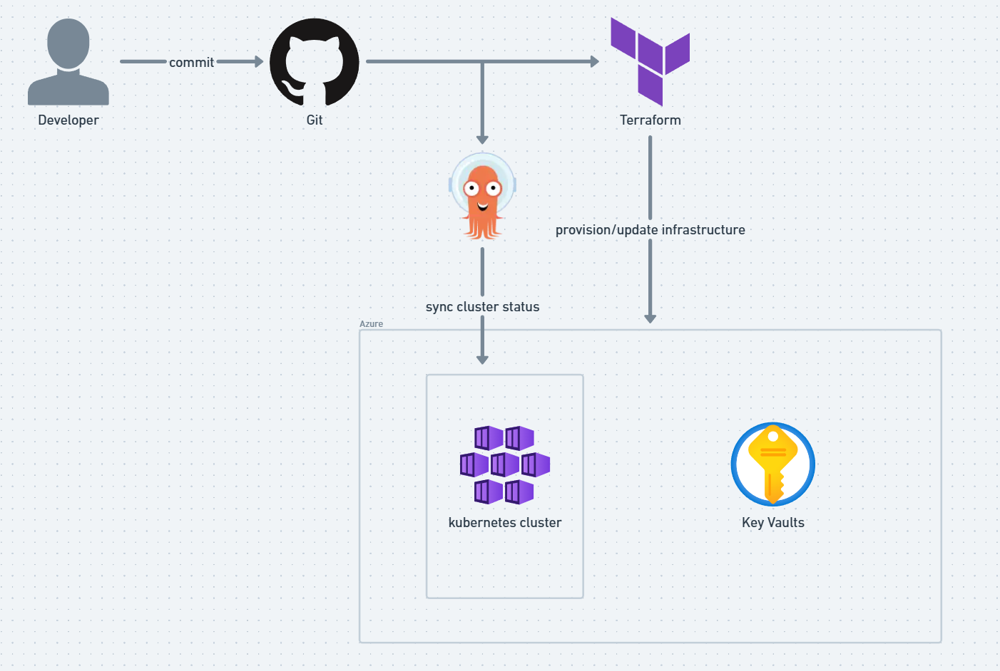

# Watmarker GitOps

This repository contains GitOps configurations for deploying the **Watmarker** application using [ArgoCD](https://argo-cd.readthedocs.io/).  
It automates both **infrastructure** and **application delivery** by continuously syncing Terraform and Kubernetes manifests from this Git repository to kubernetes cluster.

---

## 🧠 Architecture Overview

This project follows the **App of Apps** pattern in ArgoCD. A root application (`watmarker`) manages two environment-specific **ApplicationSets**:

- `staging`
- `production`

Each `ApplicationSet` dynamically generates ArgoCD Applications for:

- `api-gateway`
- `watermark` (core service)
- `web-app`

This structure makes it easy to scale environments, enforce consistent deployment patterns, and apply GitOps best practices.

---

## ☁️ GitOps + Infrastructure Flow

The infrastructure layer is managed using **Terraform** and deployed on **Azure**:

- **AKS (Azure Kubernetes Service)** runs the Watmarker workloads
- **Azure Key Vault** stores and manages application secrets securely

**Workflow:**

1. Developer commits configuration or infrastructure changes to Git
2. Terraform provisions or updates the Azure infrastructure
3. ArgoCD syncs manifests to the AKS cluster
4. The cluster stays continuously aligned with the desired Git state

---

## 🛠️ Planned Improvements

**To be done:**

- ✅ Add `infrastructure/` folder with Terraform for cluster provisioning
- [ ] Integrate **Secrets Manager** (e.g., SealedSecrets or SOPS) for better secret handling
- ✅ Add monitoring stack (**Prometheus + Grafana**) integration
- ✅ Add **Ingress networking** to expose the web app service to the public
